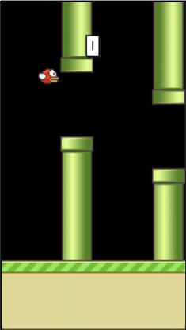
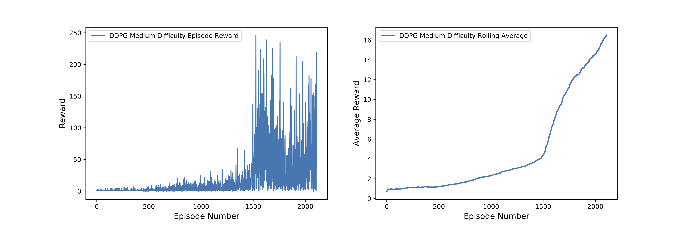

# Flappy Bird Deep Q-Learning Networks

In this project we attempt to develop models which are able to learn to play the game ‘Flappy Bird’, and ideally surpass human level scores by using Reinforcement Learning techniques. Specifically, we investigate deep q-learning networks (DQNs), to develop an general overview of the problem and deeper understanding on reinforcement learning techniques. We go through its respective technicalities, and present conclusive results on experiments and hyper-parameter selection, in order to develop an optimal policy.

The goal with this approach was to attempt to implement a method with a fundamentally different approach to tile coding function approximation. By employing Deep Q-Learning Network (DQN), we wished to showcase how computer vision and deep neural networks such as convolutional neural networks (CNNs) can be used in the context of reinforcement learning as well. Essentially, we implement a DQN which attempts to approximate the Q-function, rather than directly use the traditional Q-Learning method. We also wanted to employ ‘experience replay’ in our model, as summarised by Mnih et al. [2013], in their pseudocode. For this method, I chose to use PyGame’s Flappy Bird environment implementation (PyGame), which I watered-down to simplify the training process.

